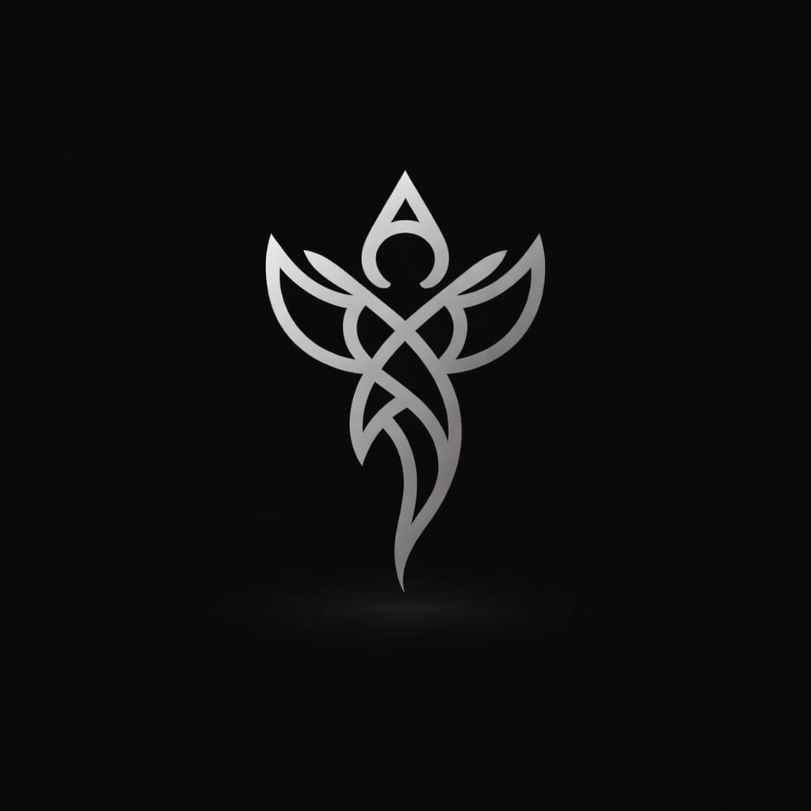

# Apsara Dark

<p align="center">
  
</p>

<p align="center">
  <strong>Your AI Companion — Real-time Voice, Vision, Code & Canvas</strong>
</p>

<p align="center">
  <em>An Android app powered by Google's Gemini Live API with a custom Node.js backend, enabling real-time voice conversations, live camera vision, AI-generated web apps, inline code execution, and web content analysis — all through natural speech.</em>
</p>

---

## What is Apsara Dark?

Apsara Dark is a native Android AI companion that lets you **talk** to Google's Gemini in real time. Unlike typical chat apps, Apsara Dark is built around **live voice** — you speak, Apsara listens and responds with natural speech, and you can interrupt her anytime (even by typing). She can see through your camera, generate full web applications, write and execute code, analyze web pages, and more — all during a single continuous conversation.

The app uses a custom Node.js backend that acts as a relay between the Android app and Google's Gemini Live API, keeping the API key secure on the server while enabling full bidirectional streaming.

---

## Features

### 🎙️ Real-Time Voice Conversations
- **Bidirectional audio streaming** — speak naturally and hear Apsara respond with one of 8 selectable voices.
- **Automatic voice activity detection (VAD)** — Gemini's built-in VAD detects when you start and stop speaking.
- **Text + voice interruption** — interrupt Apsara mid-sentence by speaking OR typing.
- **Emotion-aware (Affective Dialog)** — Apsara detects your tone and adjusts her responses accordingly.
- **Proactive audio** — Apsara can choose when to speak without being prompted.
- **Real-time transcription** — see what you say and what Apsara says as live text, even while audio is streaming.

### 📹 Live Camera Vision
- **CameraX-based live preview** — stream your camera feed to Gemini during conversations.
- **Tap-to-focus, pinch-to-zoom, flash toggle, camera flip** — full camera controls.
- **Drawing annotations** — draw on the camera preview to highlight things for Apsara.
- **Configurable media resolution** — LOW, MEDIUM, HIGH quality settings.
- **PiP mode** — minimize the camera to a small floating window.

### 🎨 Apsara Canvas (AI Web App Generation)
- **Generate full web applications from voice** — say "make me a todo app" and Apsara creates a complete HTML/CSS/JS application.
- **Supports React and vanilla web** — React via CDN or plain HTML/CSS/JS.
- **Auto-validation and error fixing** — generated code is validated and auto-fixed (up to 3 retries).
- **Mobile-first rendering** — apps are responsive by default.
- **In-app WebView** — view generated apps directly in the app.
- **Edit existing canvases** — ask Apsara to modify apps she's already built.
- **Detail viewer** — Code, Prompt, Log, Info, Config tabs for each canvas.
- **Version history** — tracks all edits to each canvas.

### 💻 Apsara Interpreter (Inline Code Execution)
- **Execute Python and JavaScript** — Apsara writes code from your natural language request and runs it.
- **Session persistence** — variables and imports persist across multiple runs in the same session.
- **Image generation** — matplotlib plots, PIL images rendered and displayed inline in chat.
- **Edit existing code** — modify previous code sessions, preserving context.
- **Code detail viewer** — Code, Output, Images, Config tabs.

### 🌐 URL Context (Web Page Analysis)
- **Analyze web pages** — give Apsara a URL and she'll fetch, read, and summarize the content.
- **Intelligent extraction** — uses Gemini to extract clean text, title, description, and word count.
- **Progress streaming** — real-time status updates as the page is fetched and analyzed.

### 🧠 Thinking & Reasoning
- **Configurable thinking budget** — control how much Apsara reasons before responding.
- **Thought summaries** — see Apsara's reasoning process in collapsible "Thoughts" sections above her responses.
- **Bold markdown** in thought text for readability.

### 🔌 Plugin System
- **10 tools** available as plugins, each independently toggleable.
- **Per-tool async/sync modes** — configure whether each tool blocks Apsara's speech or runs in parallel.
- **Tool call cards in chat** — see which tools are running, their status, and results.
- **Progress streaming** — real-time progress updates for long-running tools.

### 🔧 Session Resilience
- **Foreground service** — live session continues when app is in background.
- **Wake lock + WiFi lock** — CPU and network stay active during sessions.
- **Session resumption** — if the connection drops, Apsara reconnects without losing context.
- **GoAway handling** — graceful reconnection when Gemini signals connection refresh.
- **Context window compression** — unlimited session length via sliding window.

### 🎨 Theming
- **8 VS Code-inspired themes**: Dark, Monokai, Nightly, Solarized, Dracula, Nord, Light, Monochrome.
- **Persistent theme choice** — survives app restarts.
- **Dynamic system bars** — status/nav bar colors update per theme.

### 📳 Haptic Feedback
- **Speech-synced vibration** — device pulses in sync with Apsara's words (driven by output transcription, not raw audio).
- **Tool call haptics** — vibrates on tool call start and completion.
- **Configurable** — toggle on/off in settings.

### 📊 Audio Visualizer
- **Amplitude-driven** — visualizer bars respond to actual mic/speaker volume, not animation.
- **Instant user detection** — visualizer shows your speech immediately (no waiting for server transcription).
- **Organic movement** — sine-wave variation scaled by real audio amplitude.

---

## Architecture

```
┌──────────────────────────────────────────────────────────────┐
│                        Android App                           │
│                     (Jetpack Compose)                         │
│                                                              │
│  ┌──────────┐  ┌───────────┐  ┌──────────────────────────┐  │
│  │ HomeScreen│  │ Settings  │  │ Plugins / Canvas / Code  │  │
│  └─────┬────┘  └───────────┘  └──────────────────────────┘  │
│        │                                                     │
│  ┌─────▼────────────────────────────────────────────────┐    │
│  │          LiveSessionViewModel                         │    │
│  │   ┌──────────────┐  ┌──────────────┐                 │    │
│  │   │ WebSocket     │  │ AudioManager │                 │    │
│  │   │ Client        │  │ (Record +    │                 │    │
│  │   │ (OkHttp)      │  │  Playback)   │                 │    │
│  │   └──────┬───────┘  └──────────────┘                 │    │
│  └──────────┼───────────────────────────────────────────┘    │
│             │ WebSocket (JSON)                                │
└─────────────┼────────────────────────────────────────────────┘
              │
              ▼
┌──────────────────────────────────────────────────────────────┐
│                    Node.js Backend                            │
│                                                              │
│  ┌─────────────────────────────────────────────────────┐     │
│  │  ws-handler.js (Live Protocol)                       │     │
│  │       │                                              │     │
│  │  ┌────▼──────────────┐  ┌────────────────────────┐  │     │
│  │  │ gemini-live-       │  │ Interactions API       │  │     │
│  │  │ session.js         │  │ (Text/Chat for tools)  │  │     │
│  │  │ (Gemini Live API)  │  │                        │  │     │
│  │  └────────────────────┘  └───────────┬────────────┘  │     │
│  │                                      │               │     │
│  │  ┌──────────┐  ┌────────────┐  ┌────▼─────┐         │     │
│  │  │ Canvas   │  │ Interpreter│  │ URL      │         │     │
│  │  │ Service  │  │ Service    │  │ Context  │         │     │
│  │  └──────────┘  └────────────┘  └──────────┘         │     │
│  └─────────────────────────────────────────────────────┘     │
└──────────────────────────────────────────────────────────────┘
              │
              ▼
┌──────────────────────────────────────────────────────────────┐
│              Google Gemini Live API                           │
│         gemini-2.5-flash-native-audio                        │
└──────────────────────────────────────────────────────────────┘
```

---

## Tech Stack

### Android App
| Technology | Purpose |
|-----------|---------|
| **Kotlin** | Primary language |
| **Jetpack Compose** | UI framework |
| **Material 3** | Design system |
| **OkHttp** | WebSocket client |
| **Gson** | JSON serialization |
| **CameraX** | Camera preview + frame capture |
| **AudioRecord / AudioTrack** | PCM audio recording + playback |
| **SharedPreferences** | Settings persistence |
| **Foreground Service** | Background session persistence |

### Backend
| Technology | Purpose |
|-----------|---------|
| **Node.js 20+** | Runtime |
| **Express** | HTTP server |
| **ws** | WebSocket server |
| **@google/genai** | Gemini SDK (Live + Chat) |
| **dotenv** | Environment config |

### Infrastructure
| Component | Details |
|-----------|---------|
| **Server** | Oracle Cloud (ARM) |
| **Reverse Proxy** | Caddy |
| **Process Manager** | PM2 / systemd |
| **Domain** | `apsara-dark-backend.devshubh.me` |
| **Protocol** | WSS (TLS via Caddy) |

---

## Tools & Plugins

Apsara Dark has **10 tools** available as plugins, each independently toggleable and configurable as sync (blocking) or async (non-blocking):

| Tool | What It Does | Example |
|------|-------------|---------|
| **`get_server_info`** | Server time, uptime, Node.js version | "What time is it?" |
| **`apsara_canvas`** | Generate web apps from prompts | "Make me a snake game" |
| **`list_canvases`** | List all canvas projects | "What apps have I made?" |
| **`get_canvas_detail`** | Get full canvas details | "Show me the code for my todo app" |
| **`edit_canvas`** | Modify existing canvas | "Add a dark mode to my weather app" |
| **`run_code`** | Execute Python/JS code | "Calculate the first 50 primes" |
| **`list_code_sessions`** | List all code sessions | "What code have I run?" |
| **`get_code_session`** | Get code session details | "Show me my last code run" |
| **`edit_code`** | Modify existing code | "Change the plot to a bar chart" |
| **`url_context`** | Analyze web page content | "Summarize this article: https://..." |

**Sync mode**: Apsara waits for the tool to finish before responding (good for tools whose results she needs to speak about).

**Async mode**: Apsara continues speaking while the tool runs in the background (good for long-running operations like Canvas generation).

---

## Settings

All settings are configurable from the in-app Settings screen and persist across sessions:

### General Settings
- **Haptic Feedback** — speech-synced vibration

### Theme Settings
- 8 VS Code-inspired themes with live preview

### Live Settings
| Setting | Description | Default |
|---------|-------------|---------|
| Backend URL | WebSocket server address | `wss://apsara-dark-backend.devshubh.me/live` |
| Model | Gemini model for live sessions | `gemini-2.5-flash-native-audio-preview-12-2025` |
| Voice | Apsara's speaking voice | Kore |
| Temperature | Response creativity (0.0–2.0) | 1.0 |
| System Instruction | Custom personality prompt | Apsara personality |
| Affective Dialog | Emotion-aware responses | Off |
| Proactive Audio | Model speaks unprompted | Off |
| Input Transcription | Show user speech as text | On |
| Output Transcription | Show Apsara speech as text | On |
| Context Compression | Unlimited session length | On |
| Session Resumption | Auto-reconnect on drop | On |
| Google Search | Grounded search results | Off |
| Include Thoughts | Show model reasoning | Off |
| Thinking Budget | Reasoning depth (0=off) | Dynamic |
| Media Resolution | Camera quality (LOW/MED/HIGH) | MEDIUM |

---

## How to Run

### Backend

```bash
cd backend
cp .env.example .env
# Add your GEMINI_API_KEY to .env
npm install
npm start
```

Server starts at:
- HTTP: `http://0.0.0.0:3000`
- WebSocket: `ws://0.0.0.0:3000/live`

### Android App

1. Open the project in Android Studio.
2. Build and run on a device or emulator (min SDK 26).
3. Go to **Settings → Live Settings** and set the Backend URL to your server.
4. Tap the **Talk** card on the home screen to start a live session.

### Environment Variables (`.env`)

```
GEMINI_API_KEY=your_gemini_api_key_here
PORT=3000
```

---

## Project Structure

```
apsara-dark/
├── app/                               — Android app (Kotlin, Jetpack Compose)
│   └── src/main/java/com/shubharthak/apsaradark/
│       ├── MainActivity.kt
│       ├── data/
│       │   ├── LiveSettingsManager.kt — All settings persistence
│       │   └── MockData.kt           — Plugin cards, feature cards
│       ├── live/
│       │   ├── LiveWebSocketClient.kt — OkHttp WS client
│       │   ├── LiveAudioManager.kt    — PCM record/playback + AEC
│       │   ├── LiveSessionViewModel.kt— Session orchestrator
│       │   ├── LiveSessionService.kt  — Foreground service
│       │   ├── LiveSessionBridge.kt   — Notification bridge
│       │   └── StopLiveReceiver.kt    — End Session receiver
│       └── ui/
│           ├── components/            — Reusable UI components
│           ├── navigation/            — NavHost + routes
│           ├── screens/               — Home, Settings, Plugins, Canvas, Interpreter
│           └── theme/                 — Colors, themes, typography
│
├── backend/                           — Node.js backend
│   ├── src/
│   │   ├── server.js                  — Express + WS server
│   │   ├── config.js                  — Configuration
│   │   ├── ws-handler.js              — WebSocket protocol handler
│   │   ├── gemini-live-session.js     — Gemini Live API wrapper
│   │   ├── tools.js                   — 10 tool declarations + handlers
│   │   ├── interactions/              — Text/Chat API subsystem
│   │   ├── canvas/                    — Web app generation + serving
│   │   ├── interpreter/               — Code execution engine
│   ├── package.json
│   ├── Caddyfile                      — Reverse proxy config
│   └── DEPLOY.md                      — Deployment guide
│
├── progress.md                        — App version history (v0.0.0 → v0.0.9)
├── backend-progress.md                — Backend version history (v0.0.0 → v0.0.9)
└── README.md                          — This file
```

---

## Version History

| Version | Milestone | Key Feature |
|---------|-----------|-------------|
| **v0.0.0** | Foundation | UI shell, 8 themes, navigation, dark theme |
| **v0.0.1** | Live Voice | Gemini Live API — full backend + Android integration |
| **v0.0.2** | UX & Tools | Chat UX, thoughts, plugin system, per-tool async/sync |
| **v0.0.3** | Audio & Haptics | Amplitude visualizer, attachments, haptic feedback |
| **v0.0.4** | Resilience | Foreground service, session resumption, GoAway handling |
| **v0.0.5** | Camera | Live video camera, annotations, media resolution |
| **v0.0.6** | Canvas | Interactions API, AI web app generation & serving |
| **v0.0.7** | Interpreter | Inline code execution, images, session management |
| **v0.0.8** | URL Context | Web page analysis tool, Settings UX polish |
| **v0.0.9** | Interruption | Text interrupts speech, system-wide polish |

See [progress.md](progress.md) and [backend-progress.md](backend-progress.md) for detailed changelogs.

---

## License

Private project by [Shubharthak](https://github.com/shubharthaksangharsha).

---

<p align="center">
  <strong>Apsara Dark</strong> — Talk to your AI, see through her eyes, build with her hands.
</p>
